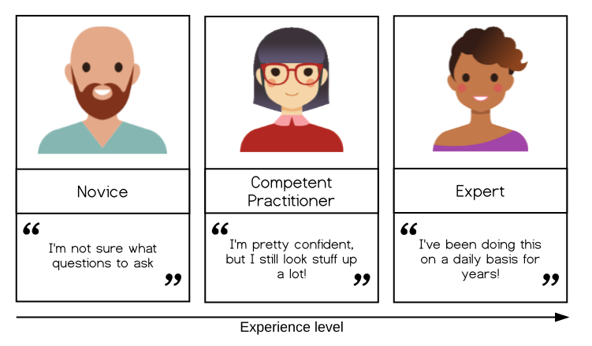
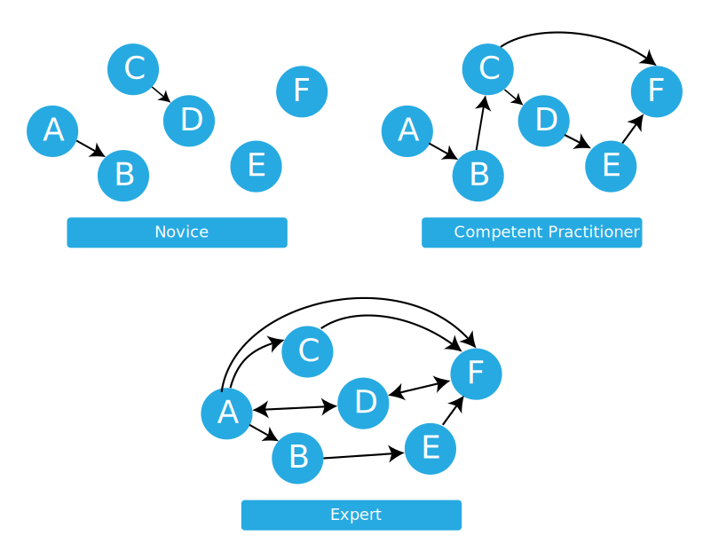

::::::::::::::::::::::::::::::::::::::: objectives

-   Compare and contrast the three stages of skill acquisition.
-   Identify a mental model and an analogy that can help to explain it.
-   Understand the limitations of knowledge in the absence of a
    functional mental model.
-   Appreciate the value in a slow pace of delivery.

::::::::::::::::::::::::::::::::::::::::::::::::::

:::::::::::::::::::::::::::::::::::::::: questions

-   How do people learn?
-   Who is a typical learner?
-   How can we help novices become competent practitioners?

::::::::::::::::::::::::::::::::::::::::::::::::::

We will now get started with a discussion of how learning works. We will
begin with some key concepts from educational research and identify how
these principles are put into practice in SRSG training workshops.

## The SRSG Pedagogical Model

The Southampton Research Software Group aims to teach computational
competence to learners. We take an applied approach adopted from the
Carpentries, avoiding the theoretical and general in favour of the
practical and specific. By showing learners how to solve specific
problems with specific tools and providing hands-on practice, we develop
learners' confidence and lay the foundation for future learning.

A critical component of this process is that learners are able to
practice what they are learning in real time, get feedback on what they
are doing, and then apply those lessons learned to the next step in the
learning process. Having learners help each other during the workshops
also helps to reinforce concepts taught during the workshops.

**An SRSG workshop is an interactive event** -- for learners and
instructors. We give and receive feedback throughout the course of a
workshop. We incorporate assessments within the lesson materials and ask
for feedback on sticky notes during lunch breaks and at the end of each
day.

One reason why practice and feedback are so important is because a
Carpentries-style workshop is not simply a source of information: It is the
starting point for development of a new skill. To understand what this
means, we will start by exploring what research tells us about skill
acquisition and development of a "mental model."

## The Acquisition of Skill

Our approach is based on the work of researchers like Patricia Benner,
who applied the [Dreyfus model of skill
acquisition](https://en.wikipedia.org/wiki/Dreyfus_model_of_skill_acquisition)
in her studies of [how nurses progress from novice to
expert](https://journals.sagepub.com/doi/10.1177/0270467604265061) ([see
also books by
Benner](https://www.worldcat.org/search?q=au%3ABenner%2C+Patricia+E.)).
This work indicates that through practice and formal instruction,
learners acquire skills and advance through distinct stages. In
simplified form, three stages of this model are:

{alt="Three people, labeled from left to right as \"Novice\", \"Competent Practitioner\", and \"Expert\". Underneath,an arrow labelled \"Experience level\" points from left to right. The \"Novice\" is quoted, \"I am not sure what questions to ask.\" The Competent Practitioner is quoted, \"I am pretty confident, but I still look stuff up a lot!\" The Expert is quoted \"I have been doing this on a daily basis for years!\""}

-   *Novice*: someone who does not know what they do not know, i.e.,
    they do not yet know what the key ideas in the domain are or how
    they relate. Novices may have difficulty formulating questions, or
    may ask questions that seem irrelevant or off-topic as they rely on
    prior knowledge, without knowing what is or is not related yet.

    > Example: A *novice* learner in a Carpentries-style workshop might never have heard of the bash shell, and therefore may have no understanding of how it relates to their file system or other programs on their computer.

-   *Competent practitioner*: someone who has enough understanding for
    everyday purposes. They will not know all the details of how
    something works and their understanding may not be entirely
    accurate, but it is sufficient for completing normal tasks with
    normal effort under normal circumstances.

    > Example: A *competent practitioner* in a Carpentries-style workshop might have used the shell before and understand how to move around directories and use individual programs, but they might not understand how they can fit these programs together to build scripts and automate large tasks.

-   *Expert*: someone who can easily handle situations that are out of the ordinary.

    > Example: An *expert* in a Carpentries-style workshop may have experience writing and running shell scripts and, when presented with a problem, immediately sees how these skills can be used to solve the problem.

Note that how a person *feels* about their skill level is not included
in these definitions! You may or may not consider yourself an expert in
a particular subject, but may nonetheless function at that level in
certain contexts. We will come back to the expertise of the Instructor
and its impact -- positive and negative -- on teaching, in the next
episode. For now, we are primarily concerned with novices, as this is
The Carpentries' primary target audience.

It is common to think of a novice as a sort of an "empty vessel" into
which knowledge can be "poured." Unfortunately, this analogy includes
inaccuracies that can generate dangerous misconceptions. In our next
section, we will briefly explore the nature of "knowledge" through a
concept that helps us differentiate between novices and competent
practitioners in a more useful and visual way. This, in turn, will have
implications for how we teach.

## Building a Mental Model

::: callout
### Models are not perfect but are still helpful

All models are wrong, but some are useful.

-   George Box, statistician
:::

Understanding is never a mirror of reality, even for an expert; rather,
it is an internal representation based on our experience with a subject.
This internal representation is often described as a **mental model**. A
mental model allows us to extrapolate, or make predictions beyond and
between the narrow limits of experience and memory, filling in gaps to
the point that things "make sense."

As we learn, our mental model evolves to become more complex and, most
importantly, more useful. A useful model makes reasonable predictions
and fits well within the range of things we are likely to encounter.
While there will always be inaccuracies -- or "misconceptions" -- these
do not interfere with day-to-day functioning. A useful model does not
seize up or break down entirely as new concepts are added.

### The power (and limitations) of analogies

Some mental models can be succinctly summarised by comparison to
something else that is more universally understood. Good analogies can
be extraordinarily useful when teaching, because they draw upon an
existing mental model to fill in another, speeding learning and making a
memorable connection. However, all analogies have limitations! If you
choose to use an analogy, be sure its usefulness outweighs its potential
to generate misconceptions that may interfere with learning.

::: challenge
## Analogy Brainstorm

1.  Think of an analogy to explore. Perhaps you have a favourite that
    relates to your area of professional interest, or a hobby. If you
    prefer to work with an example, consider this analogy from
    education: "teaching is like gardening."
2.  Share your analogy with a partner or group. (If you have not yet
    done so, be sure to take a moment to introduce yourself, first!)
    What does your analogy convey about the topic? How is it useful? In
    what ways is it wrong?

This activity should take about 10 minutes.
:::

A mental model may be represented as a collection of concepts and facts,
connected by relationships. The mental model of an expert in any given
subject will be far larger and more complex than that of a novice,
including both more concepts and more detailed and numerous
relationships. However, **both may be perfectly useful** in certain
contexts.

Returning to our example levels of skill development:

-   A *novice* has a minimal mental model of surface features of the
    domain. Inaccuracies based on limited prior knowledge may interfere
    with adding new information. Predictions are likely to borrow
    heavily from mental models of other domains which seem superficially
    similar.
-   A *competent practitioner* has a mental model that is useful for
    everyday purposes. Most new information they are likely to encounter
    will fit well with their existing model. Even though many potential
    elements of their mental model may still be missing or wrong,
    predictions about their area of work are usually accurate.
-   An *expert* has a densely populated and connected mental model that
    is especially good for problem solving. They quickly connect
    concepts that others may not see as being related. They may have
    difficulty explaining how they are thinking in ways that do not rely
    on other features unique to their own mental model.

{alt="Three collections of six circles. The first collection is labelled \"Novice\" and has only two arrows connecting some of the circles. The second collection, labelled \"Competent Practitioner\" has six connecting arrows. The third collection, labelled \"Expert\", is densely connected, with eight connecting arrows."}

## Misconceptions

Mental models are typically formed from limited experience and may work
well in familiar situations while failing in new contexts, leading to
misconceptions. Effective learning therefore requires more than adding
new information; it involves testing, revising, and reorganising existing
mental models in response to new evidence. Teaching should support this
process by helping learners make their thinking explicit, challenge their
assumptions, and develop more accurate and robust understandings.

When mental models break, learning can occur more slowly than you might
expect. The longer a prior model was in use, and the more extensively it
has to be *unlearned*, the more it can actively interfere with the
incorporation of new knowledge. Our child may quickly adapt to this new
information if they had never thought much about mass before and were
simply trying out an existing mental model on a new situation. However,
if they had extensive experience with balls that were both larger and
heavier (for example), it may take longer to unlearn what they thought
they understood about mass.

### Types of Misconceptions

Correcting learners' misconceptions is at least as important as
presenting them with correct information. There are many ways of
classifying different types of misconceptions. For our purposes, it is
useful to consider 3 broad categories:

-   Simple *factual errors*. These exist in isolation from any deeper
    understanding. These are the easiest to correct. Example: believing
    that Vancouver is the capital of British Columbia.
-   *Broken models*. These occur when inaccuracies explain relationships
    and generate predictions (often successfully!) in an existing mental
    model. These take time to address, demanding that learners reason
    carefully through examples to see contradictions. Examples:
    believing that motion and acceleration must always be in the same
    direction, or that seasons are related to the shape of the earth's
    orbit.
-   *Fundamental beliefs*, which are deeply connected to a learner's
    social identity and are the hardest to change. Examples: "the world
    is only a few thousand years old" or "human beings cannot affect the
    planet's climate". "I am not a computational person" may, arguably,
    also fall into this category of misconception.

The middle category of misconceptions is the most useful type to watch
out for in Carpentries-style workshops. While teaching, we want to expose
learners' broken models so that we can help them begin to deconstruct
them and build better ones in their place.

::: challenge
## Anticipating Misconceptions

5 mins.

Describe a misconception you have encountered as a teacher or as a learner.
:::

## Using Formative Assessment to Identify Misconceptions

In order to effectively root out pre-existing misconceptions that need
to be un-learned and stop quietly developing misconceptions in their
tracks, an Instructor needs to be actively and persistently looking for
them. But how?

Like so many challenges we will discuss in this training, the answer is
**feedback**. In this case, we want feedback that allows us to
**assess** the developing mental model of a trainee in highly specific
ways, to verify that learning is proceeding according to plan and not
careening off in some unpredicted direction. We want to get this
feedback **while we teach** so that we can respond to that information
and adapt our instruction to get learners back on track.

This kind of assessment has a name: it is called **formative
assessment** because it is applied during learning to form the practice
of teaching and the experience of the learner. This is different from
exams, for example, which sum up what a participant has learned but are
not used to guide further progress and are hence called **summative**.

Feedback from formative assessment illuminates misconceptions for both
Instructors and learners. It also provides reassurance on both sides
when learning *is* proceeding on track! It is far more reliable than
reading faces or using feelings of comfort as a metric, which tends to
be what Instructors and learners default to otherwise.

::: challenge
## Formative Assessments

5 mins.

Any instructional tool that generates feedback that is used in a
formative way can be described as "formative assessment." Based on your
previous educational experience (or even this training so far!) what
types of formative assessments do you know about?

Write your answers in the shared document; or go around and have each
person in the group name one.

:::

## The Importance of Going Slowly

It takes work to actively assess mental models throughout a workshop;
this also takes time. This can make Instructors feel conflicted about
using formative assessment routinely. However, the need to conduct
routine assessment is not the only reason why a workshop **should
proceed more slowly than you think**.

One key insight from research on cognitive development is that novices,
competent practitioners, and experts each need to be taught differently.
In particular, presenting novices with a pile of facts early on is
counter-productive, because they do not yet have a model or framework to
fit those facts into. In fact, **presenting too many facts too soon can
actually reinforce an incorrect mental model**. (This is a key problem
with the "empty vessel" analogy described earlier.)

Most learners coming to Carpentries-style lessons are novices, and do not have
a strong mental model of the concepts we are teaching. Thus, our primary
goal is **not** to teach the syntax of a particular programming
language, but **to help them construct a working mental model** so that
they have something to attach facts to. In other words, our goal is to
teach people **how to think** about programming and data management in a
way that will allow them to learn more easily on their own or understand
what they might find online.

::: testimonial
If someone feels it is too slow, they will be a bit bored. If they feel
it is too fast, they will never come back to programming. — Kunal
Marwaha, SWC Instructor
:::

If our goal is to help novices construct an accurate and useful mental
model of a new intellectual domain, this will impact our teaching. For
example, we principally want to help learners form the right categories
and make connections among concepts. We *do not* want to overload them
with a slew of unrelated facts, as this will be confusing.

An important practical implication of this latter point is the pace at
which we teach.\
In the first main episode of Software Carpentry's [lesson on the Unix
shell](https://swcarpentry.github.io/shell-novice/), which covers
"Navigating Files and Directories", there are only four "commands" for
40 minutes of teaching. Ten minutes per command may seem glacially slow,
but that episodes's real purpose is to teach learners about paths; later
on, they will learn about history, wildcards, pipes and filters,
command-line arguments, redirection, and all the other big ideas on
which the shell depends, and without which people cannot understand how
to use commands.

That mental model of the shell also includes things like:

-   Anything you repeat manually, you will eventually get wrong (so let
    the computer repeat things for you by using tab completion and the
    `history` command).
-   Lots of little tools, combined as needed, are more productive than a
    handful of programs. (This motivates the pipe-and-filter model.)

These two examples illustrate something else as well. Learning consists
of more than "just" adding information to mental models; creating
linkages between concepts and facts is at least as important. Telling
people that they should not repeat things, and that they should try to
think (by analogy) in terms of little pieces loosely joined, both set
the stage for discussing functions. Explicitly referring back to pipes
and filters in the shell when introducing functions helps solidify both
ideas.

::: callout

## Meeting Learners Where They Are

One of the strengths of Carpentries-style workshops is that we meet
learners *where they are*. Instructors strive to help learners progress
from whatever starting point they happen to be at, without making anyone
feel inferior about their current practices or skillsets. We do this in
part by teaching relevant and useful skills, building an inclusive
learning environment, and continually getting (and paying attention to!)
feedback from learners. We will be talking in more depth about each of
these strategies as we go forward in our workshop.

:::

:::::::::::::::::::::::::::::::::::::: keypoints

-   Our goal when teaching novices is to help them construct useful
    mental models.
-   Exploring our own mental models can help us prepare to convey them.
-   Constructing a useful mental model requires practice and corrective
    feedback.
-   Formative assessments provide practice for learners and feedback to
    learners and instructors.

::::::::::::::::::::::::::::::::::::::::::::::::
