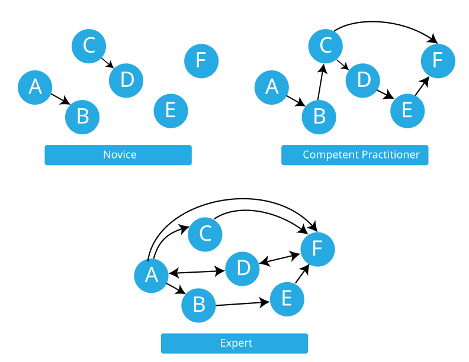

::::::::::::::::::::::::::::::::::::::: objectives

- Explain what differentiates an expert from a competent practitioner.
- Describe at least two examples of how expertise can help and hinder effective teaching.
- Identify strategies for becoming aware of your expert awareness gap.
- Demonstrate strategies for avoiding dismissive language.
- Remember the quantitative limit of human memory.
- Distinguish desirable from undesirable cognitive load.

::::::::::::::::::::::::::::::::::::::::::::::::::

:::::::::::::::::::::::::::::::::::::::: questions

- Does subject expertise make someone a great teacher?
- How are we (as Instructors) different from our learners and how does this impact our teaching?
- What is cognitive load and how does it affect learning?

::::::::::::::::::::::::::::::::::::::::::::::::::

## Examining Your Expertise

In the last episode, we discussed the transition from novice to competent
practitioner through formation of a functional mental model. We now shift
our attention to experts. The expert we want to talk about is you!

Even if you do not yet think of yourself as an expert, you may
nonetheless have advanced to the point where some of these key
characteristics -- and potential pitfalls -- apply to you. We will
discuss what distinguishes expertise from novices/competent
practitioners, how being an expert can make it more difficult to teach
novices, and some tools to help instructors identify and overcome these
difficulties.

## What Makes an Expert?

An [earlier topic](02-practice-learning) described a key difference
between novices and competent practitioners. Novices lack a mental model,
or have only a very incomplete model with limited utility. Competent
practitioners have mental models that work well enough for most
situations. How are experts different from both of these groups?

:::::::::::::::::::::::::::::::::::::::  challenge

## What Is An Expert?

5 mins.

What is something that you are an expert in? How does your experience
when you are acting as an expert differ from when you are not an expert?
Add your thoughts to the shared document.

:::::::::::::::  solution

Some points to touch on in discussion:

- The difference in feeling of expertise as:
  - A Practitioner: confidence comes from repeatedly solving real problems under realistic conditions
  - An Instructor: being confident in explaining concepts clearly and guide others through the learning process

- The difference between expert knowledge in the topic and expertise in communicating about the topic

:::::::::::::::::::::::::

::::::::::::::::::::::::::::::::::::::::::::::::::

In reviewing the answers to the question above you will find that the expert
experience amounts to much more than just knowing more facts.
Competent practitioners can memorise a lot of information
without any noticeable improvement to their performance.
So, what makes an expert? The answer is that
experts have **more connections among pieces of knowledge** that help them think and problem-solve quickly;
more "short-cuts", if you will.

{alt='Three collections of six circles. The first collection is labelled "Novice" and has only two arrows connecting some of the circles. The second collection, labelled "Competent Practitioner" has six connecting arrows. The third collection, labelled "Expert", is densely connected, with eight connecting arrows.'}

This brings us back to our mental model diagrams,
where facts are nodes and relationships are arcs.
The greater connectivity of a mental model allows experts to:

- see connections between two topics or ideas that no one else can see
- see a single problem in several different ways
- know how to solve a problem, or "what questions to ask"
- jump directly from a problem to its solution
  because there is a direct link between the two in their mind.
  Where a competent practitioner would have to reason
  "A therefore B therefore C therefore F",
  the expert can go from A to F in a single step ("A therefore F").

We will expand on some of these below and how they can manifest in the way you teach.

## Mind the Gap

Because your learners' mental models will likely be less densely
connected than your own, a conclusion that seems obvious to you will not
seem that way to your learners.  It is important to explain what you are
doing step-by-step, and how each step leads to the next one.

The problem with this is that when you are used to going from A to F in a
single leap, it can be very hard to remember that novices need to go
through steps B and C before they can understand the connection between A
and F. Experts are frequently so familiar with their subject that they
can no longer imagine what it is like to *not* understand the world that
way. This phenomenon is known in the literature as an *expert blind
spot*, although we avoid this term since it can be exclusionary to refer
to a disability for other purposes, and we strive to create an inclusive
environment for workshop instructors as well as learners.

Awareness gaps can lead to some interesting reversals in the classroom.
While deep expertise in a subject area can be valuable when teaching, it
can also create obstacles that must be overcome with practice. People
with less expertise, who still remember what it is like to have to learn
the things, can be better equipped to anticipate novice misconceptions
compared with an expert who has not learned to identify their awareness
gaps.

What does this mean for you? If you have deep expertise in the subject
you are hoping to teach, listen carefully to your learners, and seek out
less-expert colleagues to discuss your teaching plans. If, on the other
hand, you still feel new to your subject area -- perhaps you even feel a
little tentative about whether you are "expert enough" to teach -- take
heart! Your explanations may be more likely to meet novice learners where
they are.

:::::::::::::::::::::::::::::::::::::::  challenge

## Awareness Gaps

5 mins.

Choose one of the following two prompts to write about in the shared
document:

1. Is there anything you are learning how to do right now? Can you
  identify something that you still need to think about, but your teacher
  can do without thinking about it?
2. Think about the area of expertise you identified for yourself earlier.
  What could a potential awareness gap be?

::::::::::::::::::::::::::::::::::::::::::::::::::


## "Just" and Other Dismissive Language

Instructors want to motivate learners! We will talk more about motivation
in a later episode. But here, we will take a moment to recognise one
*ineffective* strategy often deployed by experts who want learners to
*believe that a task is as easy as they think it is.* This often
manifests in using the word "just" in explanations, as in, "Look, it is
easy, you just... (*wave magic wand with undecipherable incantations*)"
This language gives learners the very clear signal that the person
helping them thinks their problem is trivial and that there must be
something wrong with them if they do not experience it that way.

With practice, we can change the way we speak to avoid dismissive
language and replace it with more positive and motivating word choices.

:::::::::::::::::::::::::::::::::::::::  challenge

## Changing Your Language

5 mins.

1. What other words or phrases, besides "just", can have the same effect
   of dismissing the experience of finding a subject difficult or
   unclear?
2. Propose an alternate phrasing for one of the suggestions above.

Write your examples and alternatives in the shared document.

:::::::::::::::  solution

It is hard to break the habit of trying to convince learners that a task
is "easy"! A few alternatives might include statements like:

- "This task will become really easy once you have learned how to do it."
- "We only need to learn two new commands to accomplish the next task."
- "This task may feel like it will take you all year to learn, but in my
  experience it will take you a lot less time than that to master it."

:::::::::::::::::::::::::

::::::::::::::::::::::::::::::::::::::::::::::::::

### "Any Questions?"

Another well-intended move that can go wrong in the presence of awareness
gaps is the call for questions. An Instructor may accidentally dismiss
learner confusion by asking for questions in a way that reveals that
*they do not actually expect that anyone will have them*. Asking, "Does
anyone have any questions?" implies that most people will not; the
shorter the wait time before moving on, the more this implication is
magnified. Instead, consider asking "What questions do you have?" and
leaving a healthy pause for consideration. This firmly establishes an
expectation that people will, indeed, have questions, and should
challenge themselves to formulate them.


## Expert Advantages

As we have seen, the high connectivity of an expert's mental model poses
challenges while teaching novices. However, that is not to say that
experts cannot be great teachers! Because of their well-connected
knowledge, self-aware experts are well-poised to help students make
meaningful connections, to confidently turn an error into a learning
opportunity, or to explain a complex topic in multiple ways. Experts can
be highly effective as long as they **learn to identify and correct for
their own expert awareness gaps**. Whether or not you identify as an
expert, we hope this episode has started you on the path toward
developing that skill.


## The Importance of Practice (Again)

How can you make sure that expert awareness gaps are not negatively
affecting your workshop? Keep in touch with your learners through
frequent formative assessment! If you stumble into an expert awareness
gap, create confusion by using interchangeable terms, or accidentally
discourage rather than invite questions, formative assessment has the
power to bring these problems to the surface. As you develop teaching
skill, you may be able to avoid these pitfalls. Until then, becoming
aware of when they occur will help you to keep their impact under
control.


## Memory and Attention

### The Limits of Memory

Learning involves memory. For our purposes, human memory can be divided
into two different layers. The first is called **long-term**. It is where
we store persistent information like our friends' names and our home
address. It is essentially unbounded (barring injury or disease, we will
die before it fills up) but it is slow to access.

Our second layer of memory is called **short-term**. This is the type of
memory you use to actively think about things and is often called working
memory. It is much faster, but also much smaller: in 1956, George Miller
estimated that the average adult's short-term memory could hold **[7±2 items][wikipedia-7]**
for a few seconds before things started to drop out. This is why phone
numbers are typically 7 or 8 digits long: back when phones had dials
instead of keypads, that was the longest sequence of numbers most adults
could remember accurately for as long as it took the dial to go around
and around.

More recent research suggests that short-term memory is actually even
smaller than this. Regardless of its exact size, which may differ across
people and contexts, we know that short-term memory is limited. This has
important implications for teaching. If we present our learners with
large amounts of information, without giving them the opportunity to
practice using it (and thereby transfer it into long-term memory), they
will not retain the material as well as if we present small amounts of
information interspersed with practice opportunities. This is yet another
reason why going slowly and using frequent formative assessment is
important.

:::::::::::::::::::::::::::::::::::::::  instructor

For a semi-anonymous alternative to having learners write their score in
the shared document on the challenge below, you can create a list with
numbers and have people add X's. This also makes it easier to see the
score distribution.

*Example:*

```markdown
- 0  
- 1  
- 2  
- 3  
- 4  
- 5  
- 6  
- 7  
- 8  
- 9  
- 10  
- 11  
- 12+  
```

:::::::::::::::::::::::::::::::::::::::

:::::::::::::::::::::::::::::::::::::::  challenge

## Test Your Working Memory

5 mins.

Try a short [test of working memory][memory-test] at [https://miku.github.io/activememory/][memory-test].

What was your score? If you are comfortable, share your answer
in the shared document.

If you are unable to use this activity, ask your Trainer to implement the
analog version of this test.

::::::::::::::::::::::::::::::::::::::::::::::::::

:::::::::::::::::::::::::::::::::::::::  challenge

## Test Your Working Memory - Analog version

5 mins.

Read the following list and try to memorise the items in it:

cat, apple, ball, tree, square, head, house, door, box, car, king,
hammer, milk, fish, book, tape, arrow, flower, key, shoe

Without looking at the list again, write down as many words from the list
as you can. How many did you remember? Write your answer in the shared
document.

## Accessibility Adaptation

The list above may also be read aloud, slowly and clearly, by the Trainer
hosting the session. On your mark, ask learners to write down their
answers where others cannot see them, then read the list again so they
can check their work.

::::::::::::::::::::::::::::::::::::::::::::::::::

Most people will have found they only remember 5-7 words. Those who
remember less may be experiencing distraction, fatigue, or (as we will
learn shortly) "cognitive overload." Those who remember more are almost
invariably deploying a *memory management strategy*.

### Strategies For Memory Management

Because short-term memory is limited, we can support learners by not
flooding their short term memory with too many separate pieces of
information. Does this mean we should teach fewer concepts? Yes! However,
this is not the only tool in our toolbox. We can also assist by providing
strategies and exercises to help them form the connections that will a)
support them in holding more things in short-term memory at once and b)
begin to **consolidate** some concepts, moving them into long-term
memory.

- *Chunking*: Learners remember more by grouping related ideas into
  meaningful "chunks" rather than as isolated units. Grouping together
  logically connected learning units helps them build a mental model more
  efficiently.
- *Frequent formative assessment*: Regular, low-stakes activities that
  require learners to retrieve and apply knowledge strengthen memory and
  support transfer to long-term memory. Assessments should occur soon
  after teaching while information is still accessible, i.e. teach
  something using live coding, then get them to do a short exercise to
  test their understanding.
- *Group work*: Explaining ideas to others (elaboration) reinforces
  understanding and memory. Collaborative activities also provide
  opportunities for discussion, peer learning, and instructor support.
  Pedagogical studies confirm that some of the most useful learning
  happens between peers, as they explore their understanding (and
  misunderstandings) with others at a similar level.
- *Reflection*: Asking learners to summarise, review, or provide feedback
  encourages retrieval and helps consolidate learning into long-term
  memory.
- *Limit new concepts*: Avoid introducing too many ideas at once.
  Focusing on a smaller number of well-connected concepts reduces
  cognitive overload, and tools such as concept maps can help keep
  lessons appropriately scoped.

A related attention issue is that of *self-imposed distraction* on the
part of the learners. It's not uncommon for learners to attempt to engage
with their day-to-day work within a workshop, such as dealing with emails
and messaging colleagues on MS Teams or other platforms, or even writing
code or documents unrelated to the training. This often has a profound
effect on a learner's progress, who then may expect other learners,
helpers or the instructor to catch them up which slows down a workshop.
This should be discouraged, e.g. requesting that learners close emails,
set messaging platforms to "do not disturb" mode, mute phone
notifications, and not opening other browser tabs (and similarly, not
pasting links into the chat unless necessary). Note that this also
applies to helpers, who should be attentive to the needs of the learners!

  
### Cognitive Load

Another concept to consider when instructing a workshop is cognitive load.

Cognitive Load Theory was proposed by Psychologist John Sweller in the 1980s and has been tested and adapted over the past four decades ([Sweller, 2011](https://www.sciencedirect.com/science/chapter/bookseries/abs/pii/B9780123876911000028?via%3Dihub)).

Cognitive load refers to the amount of information that the active part of human memory can process at one time ([Ungvarsky, 2023](https://www.ebsco.com/research-starters/education/cognitive-load)).  It can also be thought of as the amount of mental effort required for a task.

We can consider two categories of cognitive load, intrinsic and extraneous ([Sweller, 2011](https://www.sciencedirect.com/science/chapter/bookseries/abs/pii/B9780123876911000028?via%3Dihub)):

- **Intrinsic cognitive load** is the complexity of knowledge that is being acquired without reference to how that knowledge is acquired.  This cannot be altered other than by altering what is to be learned or the levels of expertise of the learners.
- **Extraneous cognitive load** is imposed, not due to the complexity of the information itself, but due to the manner in which it is presented.  This can be reduced by changing instructional procedures.

Cognitive load is not always a bad thing! There is plenty of evidence that *some* difficulty is desirable and can increase learning. However, there are limits. Managing all forms of cognitive load, with particular attention to extraneous load, can help prevent **cognitive overload** from impeding learning altogether. 

There are several effects of cognitive load theory that we as instructors can use in order to work with, rather than against, cognitive load when instructing workshops:

1. **Isolated elements**: Under high intrinsic cognitive load (i.e. when a subject is complex), presenting interacting elements first as isolated elements can decrease intrinsic cognitive load. This might involve breaking down a `for` loop into each individual element of syntax or breaking down a custom ggplot graph into each layer of the plot.
2. **Split-attention effect**: There is cognitive effort associated with assembling information from different modalities. To minimise cognitive load caused by the split-attention effect, the visual environment in a workshop should be focused on exactly what you are teaching and should mirror, as closely as possible, exactly what you say. This is why, in most situations we do not recommend displaying training curriculum materials to your learners while you teach.  Instead, we ask Instructors to speak commands as they type them on the screen while engaging learners in participatory live coding.
3. **Worked example**: For learners new to a topic, demonstrating a problem solution can reduce the extraneous cognitive load associated with problem solving. This may take the form of guided practice, where the instructor steps through the problem with the learner, giving feedback at each step before moving on to the next element.


A recently added cognitive load effect is the **transient information effect**.  With easy access to search engines and generative AI, information that previously needed to be held in long-term memory can now be looked up easily using technology. Therefore, the information has become transient rather than permanent.  However, having to look up information every time it's needed increases extraneous cognitive load. One of the long-term benefits of learning to code without overly relying on those tools is a decreased extraneous cognitive load due to the transient information effect.

:::::::::::::::::::::::::::::::::::::::::  callout

## Is Guided Practice "Hand Holding?"

An alternative to guided practice is a *minimal guidance* approach, where
learners are given raw materials (for example a text or reference) and
asked to explore and learn to solve problems on their own. Minimal
guidance is commonly found in many instructional strategies you may have
encountered, variously known as *constructivist*, *discovery*,
*problem-based*, *experiential* or *inquiry-based* learning.

These strategies are not without merit! Indeed, they can work
exceptionally well with advanced learners. However, they frequently fall
flat, especially with novice audiences. A landmark paper by [Kirshner et
al.][kirschner-paper] responds to the popularity and uneven success of
minimal guidance, applying cognitive load theory to understand why these
strategies often fail.

Some people feel concerned that guided practice amounts to
"hand-holding," implying that learners who receive support may never
learn to function independently. This view fails to account for the
*additional cognitive load* experienced by novices creating new
connections while learning a task. **Minimally-guided instruction
requires learners to simultaneously master a domain's factual content AND
its search and problem-solving strategies.** Fostering creativity and
independence takes time. Minimal guidance is intuitively appealing, but
that does not mean it always works.

::::::::::::::::::::::::::::::::::::::::::::::::::


## Attention is a Limited Resource

Memory is not the only cognitive resource that is limited. Attention is
constrained as well, which can limit the information that enters short
term memory in the first place as well as interfere with attempts at
consolidation.

While many people believe that they can "multi-task", the reality is that
attention can only focus on one thing at a time. Adding items that demand
attention adds more things to alternate between attending to, which can
reduce efficiency and performance on all of them. In a teaching context, this means anything that pulls a learner's attention away from the task at hand, such as background noise, an unrelated notification, or a poorly laid-out slide, competes directly with their ability to take in and process new material, regardless of how well that material has been designed.


[wikipedia-7]: https://en.wikipedia.org/wiki/The_Magical_Number_Seven,_Plus_or_Minus_Two
[memory-test]: https://miku.github.io/activememory/
[wikipedia-cognitive-load]: https://en.wikipedia.org/wiki/Cognitive_load
[kirschner-paper]: https://www.tandfonline.com/doi/pdf/10.1207/s15326985ep4102_1
[wikipedia-split-attention]: https://en.wikipedia.org/wiki/Split_attention_effect

:::::::::::::::::::::::::::::::::::::::: keypoints

- Experts face challenges when teaching novices due to expert awareness gaps.
- Things that seem easy to us are often not experienced that way by our learners.
- With practice, we can develop skills to overcome our expert awareness gaps.
- Most adults can store only a few items in short-term memory for a few seconds before they lose them again.
- Things seen together are remembered (or mis-remembered) in chunks.
- Cognitive load should be managed through guided practice to facilitate learning and prevent overload.
- Formative assessments can help to consolidate learning in long-term memory.

::::::::::::::::::::::::::::::::::::::::::::::::::
