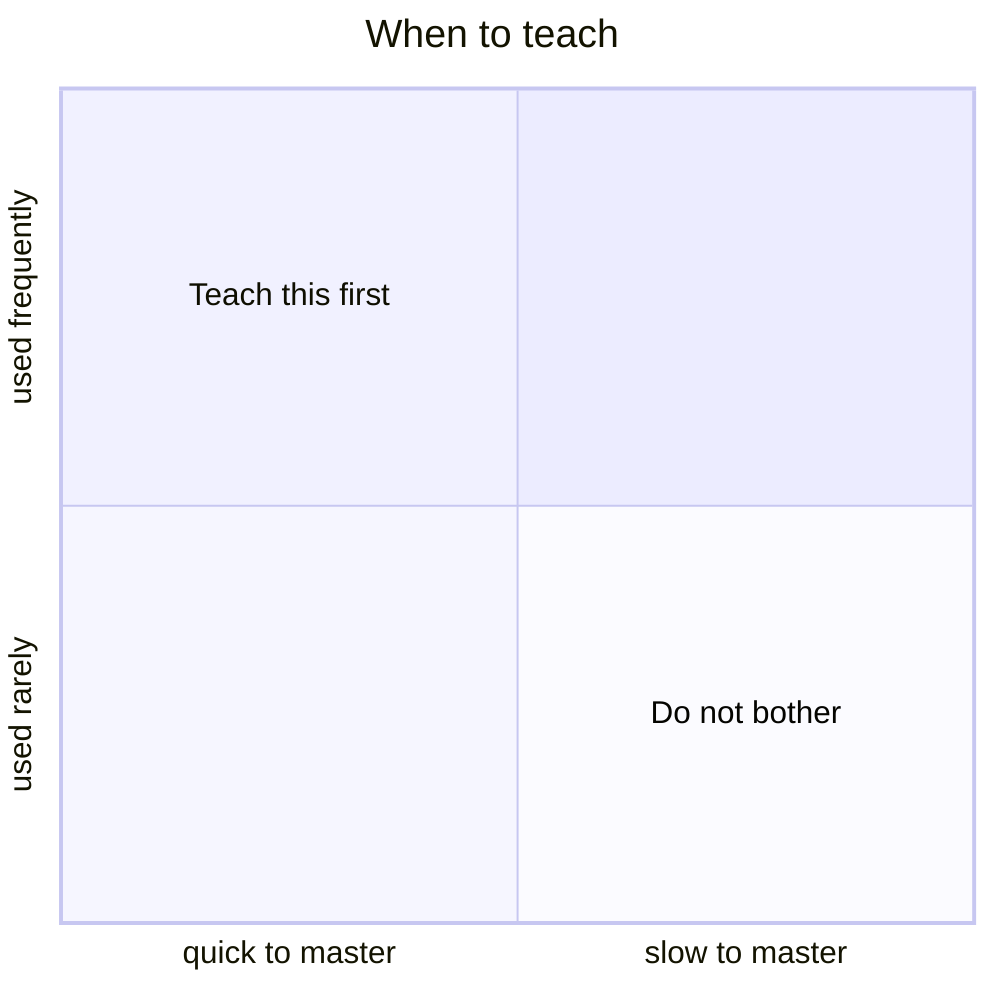
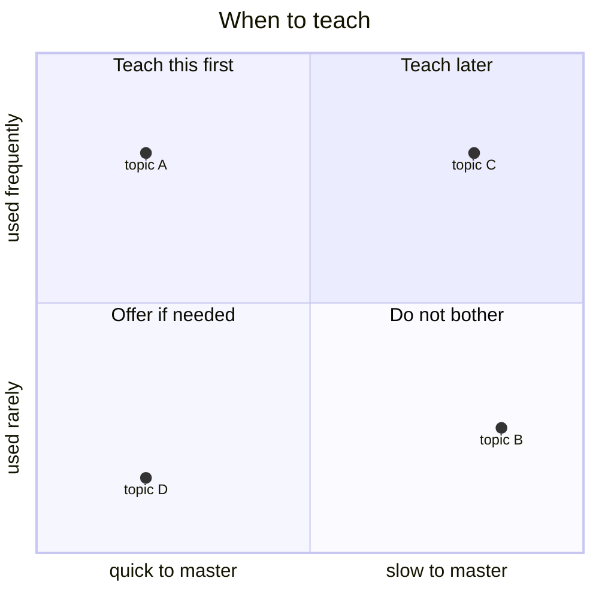

::::::::::::::::::::::::::::::::::::::: objectives

- Identify authentic tasks and explain why teaching them is important.
- Develop strategies to avoid demotivating learners.
- Distinguish praise based feedback on the type of mindset it promotes.
- Recognise systemic factors that can distract and demotivate learners.
- Understand the role of The Carpentries Code of Conduct in maintaining an explicitly inclusive environment.

::::::::::::::::::::::::::::::::::::::::::::::::::

:::::::::::::::::::::::::::::::::::::::: questions

- Why is motivation important?
- How can we create a motivating environment for learners?
- Why are equity, inclusion, and accessibility important?
- What can I do to enhance equity, inclusion, and accessibility in my workshop?

::::::::::::::::::::::::::::::::::::::::::::::::::

TODO: too long. shorten this episode by about 10 mins of content

## Motivation Matters

Teaching and learning are not the same process. As we have seen, an
instructor can make choices that facilitate the cognitive processes
necessary for learning to occur. But **any technique can fall flat when
learners are not motivated**. Worse, demotivation is contagious! Teaching
or sharing a classroom with demotivated learners is not fun or rewarding.
It can be tempting, especially for teachers facing burnout after
strenuous and ineffectual effort, to blame learners for spoiling the
classroom experience.

No two-day workshop can truly bring a total novice to the level of a
competent practitioner. Carpentries-style workshops function in a context
of *self training*, in which workshops offer vital tools and a map for
learners to proceed on their own. Our workshops lower the barrier to
entry and help learners to get off on the right foot. In this context,
**cultivating motivation to continue learning, and to carefully pursue
best-practices in doing so, is arguably the most important outcome we can
achieve**.

This section discusses several ways that learners can be motivated (or
demotivated!) by instructional content and approaches, and provides
practice opportunities for you to become confident in motivating your
learners.

## How Can Content Influence Motivation?

People learn best when they care about a topic and believe they can
master it with a reasonable investment of time and effort. Many
scientists might appreciate the value of programming but believe that
developing useful skills will take more time than they have available.
This presents a problem because **believing that something will be too
hard to learn often becomes a self-fulfilling prophecy**.

One way to combat this problem is to begin a lesson with something that
is **quick to learn and immediately useful**. It is particularly
important that *learners* see it as useful in their daily work. This not
only motivates them, it also helps build their confidence in us, so that
if it takes longer to get to something they find useful in a later topic,
they will persist with the lesson.

Imagine a graph whose axes are labelled "mean time to master" and
"usefulness once mastered". Tasks that are quick to master and
immediately useful should ideally be taught first; things in the opposite
corner that are time-consuming to learn and have little near-term
application should be avoided in our workshops.

Another way to think about the graph shown above is **authentic tasks**
-- real tasks performed by someone doing their work. If you can identify
authentic tasks from your own work that could be useful to others, these
examples will be highly motivating.

This 2x2 grid can be useful for longer term lesson planning and
development as well as for considering how to answer questions. It's also
useful when considering where to go next. It wouldn't be a good idea to
go directly from something that's easy to master and used frequently to
something that's the absolute opposite: there are graduations in-between,
with these logically grouped into separate courses. Plus, many of those
learning the basics may not ever need to know or care much about the more
advanced, harder to learn topics even if learning them was achievable
within a single lesson.

:::::::::::::::::::::::::::::::::::::::  challenge

## Authentic Tasks: Think, Pair, Share

5 mins.

**Think** about some task you did this week that uses one or more of the
skills we teach, (e.g. wrote a function, bulk downloaded data, built a
plot in R, forked a repo) and explain how you would use it (or a
simplified version of it) as an exercise or example in class. **Pair** up
with your neighbor and decide where this exercise fits on a graph of
"short/long time to master" and "low/high usefulness".

In the shared document, **share** the task and where it fits on the
graph, using the lettered points in the diagram below. As a group, we
will discuss how these relate back to our "teach most immediately useful
first" approach.

::::::::::::::::::::::::::::::::::::::::::::::::::

:::::::::::::::::::::::::::::::::::::::::  callout

## Actual Time

Any useful estimate of time must take into account **how frequent
failures are** and how much time is lost to them. For example, editing a
text file seems like a quick task, but most graphical editors save things
to the user's desktop or home directory. If a novice needs to run shell
commands on the files they've edited, they often fail to navigate to the
right directory without help.

You will learn to anticipate these sorts of challenges as you chart your
[expert awareness gaps](04-learning-process.md#mind-the-gap). As a
result, your skill at estimating time to mastery will improve. If you are
new to teaching, try to ask an experienced instructor for feedback before
trying out a new exercise.

::::::::::::::::::::::::::::::::::::::::::::::::::

While we aim to begin workshops with motivating content, in practice this
does not always occur. Workflow-based content like that taught in Data
Carpentry workshops may start at the beginning of the workflow, for
example. Even when a 'motivating example' is built in to the start of a
workshop, technical problems like software installation can turn those
precious first minutes into an experience of frustration and impatience.
That is ok! What is important is to **be mindful of times when your
content is not motivating**, and to strategise ways to re-engage learners
(and yourself) using some of the other techniques in this section.

## How Can You Affect Motivation?

In addition to teaching things that will make our learners' lives easier
and focusing on authentic tasks, there are a number of other strategies
we can use to motivate learners when we teach.

:::::::::::::::::::::::::::::::::::::::  challenge

## Brainstorming Motivational Impacts

5 mins.

Think back to courses you have taken in the past and consider things that
an instructor has said or done that you found either **motivating** or
**demotivating**. Try to think of one example in each case, and share
your example under the appropriate heading in the shared document.

::::::::::::::::::::::::::::::::::::::::::::::::::

::::::::::::::::::::::::::::::::::::: instructor

After trainees write in the shared document, one way to discuss/review
comments is to note which items in either list suggest practices that
trainees can employ in their teaching and in particular to review how
topics discussed already in the training (going slowly, expert awareness
gaps, formative assessment, memory management, etc) can help mitigate the
demotivating or are present in the motivating examples. 

::::::::::::::::::::::::::::::::::::::::::::::::::

### Invite Participation

Active participation increases motivation by helping learners ask
questions, overcome obstacles, build confidence, and learn from one
another. Because many learners are initially reluctant to speak up,
create an environment where communication is welcomed and encouraged.

Ways to encourage participation include:

- Establish clear interaction norms, offering multiple ways to contribute
  (e.g. verbally, chat, or shared documents) and using a clear Code of
  Conduct.
- Promote peer learning, such as [pair programming](https://en.wikipedia.org/wiki/Pair_programming),
  so learners can discuss ideas, reinforce understanding, and support each
  other. Ensure the less experienced learner does the typing!
- Respond positively to confusion by acknowledging questions and
  uncertainty. This encourages others to speak up and helps identify gaps
  in understanding.

### Encourage a Growth Mindset

People vary in their beliefs about the nature of intelligence and skill
development. In academic environments, people are often praised as
"talented" or having "high ability", and may develop an identity around
being a certain "type of person" who has inherent strengths or
weaknesses.

The belief that ability or intelligence is born rather than made --
dubbed a **fixed mindset** by Carol Dweck -- may impact the learning
process. Broadly, this is a continuing topic of research and debate in
education communities. In the specific context of Carpentries-style
workshops, we frequently encounter learners who believe that they are not
"computational people," and Instructors often report that this fixed
mindset interferes with motivation to engage fully with the task of
learning to program. We therefore recommend four types of interventions
that have been shown to influence mindset, encouraging learners to
believe that ability can be acquired through effort -- a **growth
mindset**.

- **Positive error framing**. Errors are inevitable when learning a new
  skill. However, learners will often interpret errors as indicators of
  inability -- adopting a fixed mindset. Encouraging learners to
  understand errors in a positive way -- as an opportunity to learn
  something they would have missed otherwise -- reinforces a growth
  mindset and helps them to stay motivated. Be sure to discuss this with
  your helpers, since they are often the 'first responders' to learner
  mistakes.

:::::::::::::::::::::::::::::::::::::::  challenge

## Helping Learners Learn From Mistakes

5 mins.

A learner at your workshop asks for your help with an exercise and shows
you their attempt at solving it. You see they've made an error that shows
they misunderstand something fundamental about the lesson (for example,
in the shell lesson, they forgot to put a space between `ls` and the name
of the directory they are looking at). What would you say to the learner?

In the shared document, describe the error your learner has made and how
you would respond.

::::::::::::::::::::::::::::::::::::::::::::::::::

- **Presenting the instructor as a learner**. We want our learners to
  have confidence in our qualifications, but it is easy to take this too
  far. Presenting yourself as a learner offers a relatable model,
  fostering a growth mindset and teaching a positive approach to the
  continuing challenge of learning. Using [participatory liv coding](17-live),
  our chosen method for teaching concepts, is very useful for this
  reason. It is common to make errors while coding. Embrace these with
  enthusiasm! Leveraging your own mistakes as opportunities can turn an
  awkward moment into a highlight of a lesson, demonstrating both
  problem-solving approaches and positive error framing. If you are
  unlucky and fail to make any useful mistakes, sharing stories about
  your learning process can help here, too.

:::::::::::::::::::::::::::::::::::::  testimonial

## Typos

The typos are the pedagogy.
— Emily Jane McTavish

::::::::::::::::::::::::::::::::::::::::::::::::::

- **Praising effort or improvement, not performance or ability**. Praise
  based on the quality of performance often feels like the highest praise
  because it goes straight to your identity as a person of intellect and
  skill. When faced with a fixed mindset ("I'm not a computational
  person!"), many well-intentioned teachers counter with another fixed
  mindset ("You ARE a computational person! You're really good at
  this!"). However, this doesn't prepare learners to interpret future
  obstacles as irrelevant to innate ability. Evidence suggests that
  learner perseverance is best supported in the long term by praising
  effort or improvement instead. If you are not convinced of this,
  consider the impact on the person sitting next to your target, who
  might overhear but not receive the same praise.

:::::::::::::::::::::::::::::::::::::::  challenge

## Choosing our Praises

5 mins.

Since we are so used to being praised for our performance, it can be
challenging to change the way we praise our learners. Which of these
examples of praise do you think are based on performance, effort, or
improvement?

1. That's exactly how you do it -- you haven't gotten it right yet, but
   you've tried two different strategies to solve that problem. Keep it
   up!
2. You're getting to be really good at that. See how it pays to keep at
   it?
3. Wow, you did that perfectly without any help. Have you thought about
   taking more computing classes?
4. That was a hard problem. You didn't get the right answer, but look at
   what you learned trying to solve it!
5. Look at that - you're a natural!

:::::::::::::::  solution

## Solution

1. Effort-based.
2. Improvement-based.
3. Performance-based.
4. Improvement-based.
5. Performance-based.  

:::::::::::::::::::::::::

::::::::::::::::::::::::::::::::::::::::::::::::::

### First, Do No Harm!

When learning a skill, we develop more than expert awareness gaps -- we
also develop opinions about tools and methods, and sometimes base a
professional identity around displaying technical expertise. Technical
boasts, insults, and other showy moves can score points in conversation
with fellow experts, but these present serious hazards in the classroom!
Here are a few **things you should not do in your workshop:**

- **Talk contemptuously or with scorn about any tool or practice**, or
  the people who use them. Regardless of its shortcomings, many of your
  learners may be using that tool, and may have invested many years in
  learning to do so. Convincing someone to change their practices is much
  harder when they think you disdain them.
- **Dive into complex or detailed technical discussion** with the one or
  two people in the audience who clearly don't actually need to be there.
  Reserve those conversations for breaks or follow-up emails.
- **Pretend to know more than you do**. People will actually trust you
  more if you are frank about the limitations of your knowledge, and will
  be more likely to ask questions and seek help. (Also see "Presenting
  the instructor as a learner," above)
- **Use the word "just" or other demotivating words** we talked about in
  a [previous episode](04-learning-process.html). These signal to the
  learner that the instructor thinks their problem is trivial and by
  extension that they therefore must be deficient if they are not able to
  figure it out.
- **Take over the learner's keyboard**. It is rarely a good idea to type
  anything for your learners. Doing so can be demotivating for the
  learner (as it implies you don't think they can do it themselves or
  that you don't want to wait for them). It also wastes a valuable
  opportunity for your learner to develop muscle memory and other skills
  that are essential for independent work.
- **Express surprise at unawareness**. Saying things like "I can't
  believe you don't know X" or "You've never heard of Y?" signals to the
  learner that they do not have some required pre-knowledge of the
  material you are teaching, that they don't belong at the workshop, and
  it may prevent them from asking questions in the future. For more on
  this see the Recurse Center's [Social Rules][recurse-social-rules].

It can be difficult to avoid these demotivators entirely. Some people are
so used to complaining about certain tools that they initially fail to
realise they're doing it while teaching. If you catch yourself doing
this, you might find a way to walk it back, or consider how you might
repair or improve your motivational efforts on your next interaction.
Teaching yourself -- and your helpers! -- to avoid these types of
comments takes practice, but is well worth the effort.

## Not Just Learners

What we have not discussed yet is strategies to motivate the
*instructor*. But why does *your* motivation matter?

- **Learners respond to an instructor's enthusiasm**. The more motivated
  you are, the more motivated they will be. Teaching enthusiasm has been
  consistently linked to better learning outcomes.
- **Instructors are learning to teach.** This takes motivation, too!
  Deliberative practice, seeking feedback, and reflecting on mistakes in
  the context of your own busy work life is a challenge. What will keep
  you energized to stay engaged with your learning process?
- **Carpentries Instructors teach because they want to.** Whether you are
  truly volunteering your time or are fulfilling a role in a job you have
  chosen, teaching is something you came here motivated to do. Teaching
  can be an incredibly gratifying activity! Finding and preserving your
  own motivation through the many challenges ahead will make your journey
  as a teacher a more joyful one.

[recurse-social-rules]: https://www.recurse.com/manual#sec-environment

## Creating an Inclusive Learning Environment

A positive learning environment does not happen by chance. Learners bring
different experiences, backgrounds and needs, so creating an effective
workshop requires more than treating everyone the same. Inclusive
teaching aims to remove barriers wherever possible so that all
participants have an equal opportunity to learn and contribute.

### Equity, Inclusion and Accessibility

- *Equity* means recognising that different learners may need different
  forms of support to achieve comparable outcomes.
- *Inclusion* means ensuring everyone feels welcomed, respected and
  able to participate.
- *Accessibility* means approaching and designing learning so that as
  many people as possible can access and engage with it.

### Recognising Bias

Everyone relies on unconscious assumptions and stereotypes, but these can
influence how we teach, who we engage with, and how learners experience
the workshop. Be aware of your own behaviour, encourage participation
from everyone, and avoid reinforcing stereotypes.

### Practical Inclusive Teaching

We create an inclusive environment in our workshops by:

- Setting expectations through a Code of Conduct,
- Encouraging respectful participation,
- Actively inviting quieter learners into discussions,
- Providing anonymous opportunities for feedback,
- Encouraging reflection on your own teaching practice, and
- Continually improving accessibility over time.

Small, incremental improvements make a meaningful difference and help
create workshops where every learner has the opportunity to succeed.

:::::::::::::::::::::::::::::::::::::::: keypoints

- A positive learning environment helps people concentrate on learning.
- People learn best when they see the utility in what they're learning and believe it can be accomplished with reasonable effort.
- Encouraging participation and embracing errors helps learners to stay motivated.
- Remove barriers to participation wherever practical rather than relyiny on individual requests.
- Foster a respectful, welcoming environment where everyone can participate.
- Regularly reflect on your teaching and use learner feedback to improve inclusivity.

::::::::::::::::::::::::::::::::::::::::::::::::::

